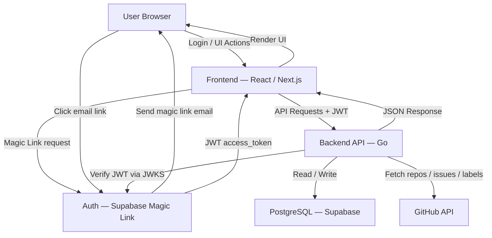
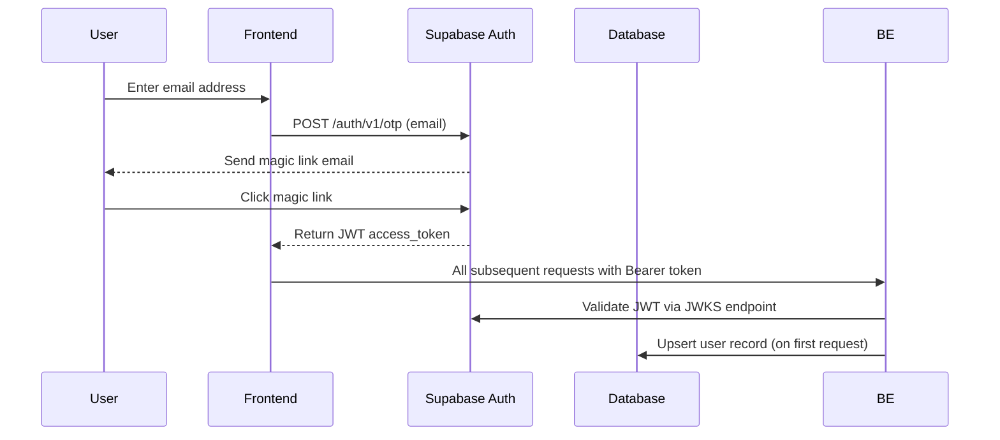
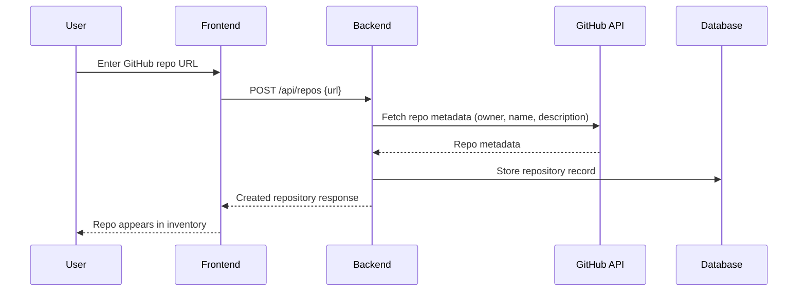
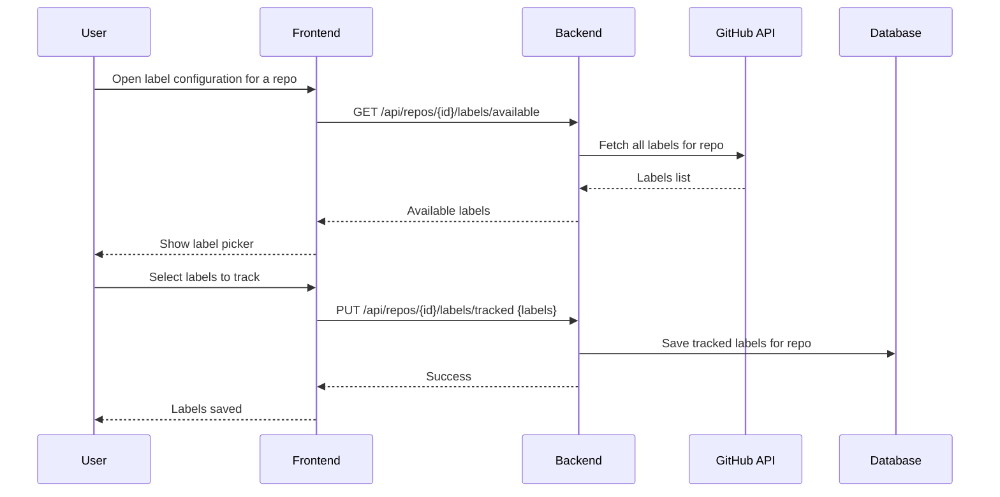
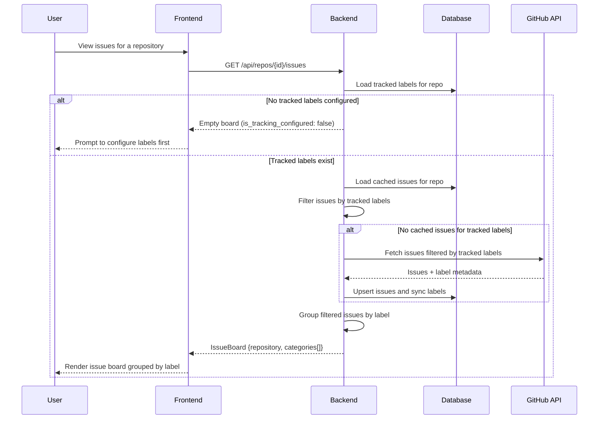
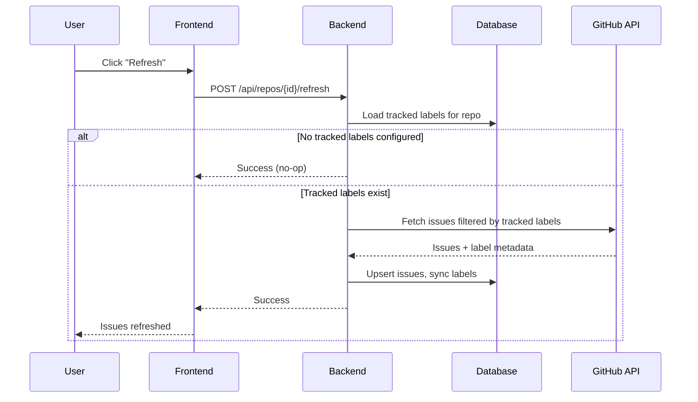

# 🧭 Architecture Overview

This document describes the system architecture and data flow for IssueBoard.

The application allows users to:
- Authenticate via Supabase Magic Link (passwordless, email-based)
- Add GitHub repositories to their personal inventory
- Fetch available labels from those repositories and select which ones to track
- View issues grouped by their tracked labels
- Manually trigger a refresh to pull the latest issues from GitHub

---

# 🏗️ High-Level Architecture

> **Note:** There is no background worker or in-memory cache. Issues are fetched from GitHub on demand when a refresh is triggered, and stored in PostgreSQL for subsequent reads.

---

# 🔐 Authentication Flow (Supabase Magic Link)

Authentication is fully passwordless. Users enter their email, receive a one-time magic link, and click it to get a JWT access token issued by Supabase.

> In local development, magic link emails are intercepted by **Mailpit** at [localhost:54324](http://localhost:54324) — no real email is sent.

---

# 📦 Add Repository Flow

Users add a repository by providing its GitHub URL. The backend validates it exists on GitHub and stores the metadata.

---

# 🏷️ Label Selection Flow

Before issues can be displayed, the user must select which labels to track. This is a one-time setup per repository that can be updated any time.

> The user can also view currently tracked labels at any time via `GET /api/repos/{id}/labels/tracked`.

---

# 🐞 Fetch Issues Flow

Issues are fetched from the database and grouped by the user's tracked labels. If no cached issues exist for the tracked labels, a GitHub refresh is triggered automatically.

---

# 🔄 Manual Refresh Flow

Users can trigger a refresh at any time to pull the latest issues from GitHub for a repository.

---
